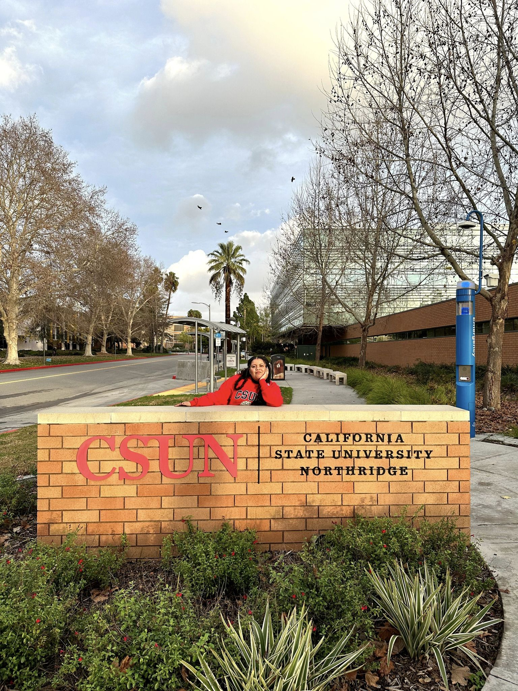

# Bem-vindas a Oficina de Javascript

# Quem sou eu?

Olá, eu sou Mariana Lima, moro no Rio de Janeiro e sou formada em pedagogia e engenharia de software, trabalho como Engenheira de Software e sou mãe da Vitória🥰

 

 Minhas redes ✨

   [Linkedin](https://www.linkedin.com/in/mariana-lima-8a5640141/)

***

# Como irá funcionar essa oficina

Neste repositório, você encontrará todos os materiais e atividades necessários para esse dia

# Dinâmica das aulas:

- Introdução (60 min): Apresentação dos conceitos e ferramentas que utilizaremos durante o curso.

- Intervalo (5 min): Um pequeno descanso para se conectar!

- Segunda parte da aula (45 min): Mãos à obra! Vamos praticar os conhecimentos adquiridos.

- Projeto Final (45 min): Apresentação do projeto final e início da sua implementação.

